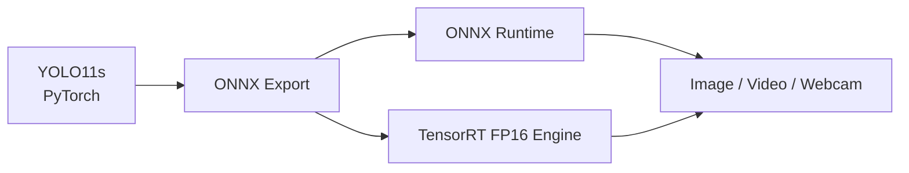

# YOLO11s Real-Time Detection & TensorRT Deployment

Production-oriented computer vision deployment pipeline for YOLO11s, covering PyTorch inference,
ONNX export, ONNX Runtime inference, TensorRT FP16 engine generation, real-time detection, and
latency benchmarking.

## Highlights

- Clean backend-independent detection API
- Image, video, and webcam inference
- OpenCV visualization with labels, confidence scores, and FPS
- ONNX export with artifact validation
- ONNX Runtime inference on CPU or CUDA Execution Provider
- TensorRT 10.x engine generation with FP16 support
- Static and dynamic ONNX input support
- CUDA buffer allocation, asynchronous execution, and stream synchronization
- Class-aware NMS and source-coordinate box projection
- Synchronized PyTorch, ONNX Runtime, and TensorRT benchmarks
- Modular `src` layout with type hints, tests, and command-line tools

## Deployment Pipeline



## Detection Contract

All inference backends return plain Python dictionaries instead of exposing framework-specific
result objects:

```python
[
    {
        "class_id": 0,
        "class_name": "person",
        "confidence": 0.91,
        "bbox": [124.2, 68.5, 438.7, 612.1],
    }
]
```

This keeps application code independent from Ultralytics, ONNX Runtime, and TensorRT internals.

## Project Structure

```text
yolo11-tensorrt-realtime/
├── configs/                    # RPS and pothole dataset configurations
├── src/yolo11_deploy/
│   ├── detector.py             # Ultralytics adapter and detection contract
│   ├── preprocessing.py        # Letterbox and NCHW preprocessing
│   ├── postprocessing.py       # Output decoding, NMS, and box projection
│   ├── onnx_runtime.py         # ONNX Runtime backend
│   ├── tensorrt_runtime.py     # TensorRT 10.x runtime and CUDA buffers
│   ├── benchmark.py            # Shared latency statistics
│   └── visualization.py        # OpenCV rendering
├── scripts/                    # Detection, export, build, and benchmark CLIs
├── tests/                      # Unit tests
├── docs/                       # Deployment and benchmark documentation
├── requirements.txt
└── requirements-tensorrt.txt
```

## Requirements

- Python 3.10+
- PyTorch
- Ultralytics
- OpenCV
- NumPy
- ONNX
- ONNX Runtime
- NVIDIA CUDA and TensorRT 10.x for the TensorRT backend

## Installation

### Core Environment

Windows PowerShell:

```powershell
py -3.10 -m venv .venv
.\.venv\Scripts\Activate.ps1
python -m pip install --upgrade pip
python -m pip install -e ".[dev]"
```

Linux:

```bash
python3 -m venv .venv
source .venv/bin/activate
python -m pip install --upgrade pip
python -m pip install -e ".[dev]"
```

### TensorRT Environment

Install the NVIDIA driver, CUDA, and TensorRT version appropriate for the target machine, then
install the Python runtime dependencies:

```powershell
python -m pip install -r requirements-tensorrt.txt
```

See [docs/deployment.md](docs/deployment.md) for environment checks and deployment guidance.

## Quick Start

Ultralytics downloads the official `yolo11s.pt` weight on first use when the file is not available
locally. Model artifacts are excluded from Git.

```powershell
python scripts/smoke_test.py
```

## Image Detection

```powershell
python scripts/detect_image.py `
  --model yolo11s.pt `
  --source assets/demo.jpg `
  --device cuda:0 `
  --output outputs/detection.jpg
```

## Video Detection

```powershell
python scripts/detect_video.py `
  --model yolo11s.pt `
  --source video.mp4 `
  --device cuda:0 `
  --save outputs/detected-video.mp4
```

Supported containers are MP4, AVI, and MOV. Press `Esc` or `Q` to close the preview. Use
`--no-display` for headless processing.

## Webcam Detection

```powershell
python scripts/detect_camera.py --model yolo11s.pt --camera 0 --device cuda:0
```

The camera is released cleanly on exit, stream failure, or model initialization failure.

## Export ONNX

Static FP32 model:

```powershell
python scripts/export_onnx.py `
  --model yolo11s.pt `
  --imgsz 640 `
  --output weights/yolo11s.onnx
```

Dynamic model:

```powershell
python scripts/export_onnx.py `
  --model yolo11s.pt `
  --imgsz 640 `
  --dynamic `
  --output weights/yolo11s-dynamic.onnx
```

The exporter verifies that the output file exists and contains data.

## ONNX Runtime Inference

```powershell
python scripts/infer_onnx.py `
  --model weights/yolo11s.onnx `
  --source assets/demo.jpg `
  --device auto `
  --imgsz 640
```

`--device auto` selects CUDA Execution Provider when available and falls back to CPU Execution
Provider. `--imgsz` supplies the runtime dimensions for a dynamic ONNX model.

## Build a TensorRT Engine

Static FP16 engine:

```powershell
python scripts/build_tensorrt.py `
  --onnx weights/yolo11s.onnx `
  --engine weights/yolo11s-fp16.engine `
  --fp16 `
  --workspace 4
```

Dynamic ONNX models use an optimization profile:

```powershell
python scripts/build_tensorrt.py `
  --onnx weights/yolo11s-dynamic.onnx `
  --engine weights/yolo11s-dynamic-fp16.engine `
  --fp16 `
  --min-imgsz 320 `
  --opt-imgsz 640 `
  --max-imgsz 1280
```

The builder validates TensorRT and CUDA availability, parses ONNX errors, configures workspace and
optimization profiles, writes the serialized engine, and preserves class-name metadata in a JSON
sidecar.

## TensorRT Inference

```powershell
python scripts/infer_tensorrt.py `
  --engine weights/yolo11s-fp16.engine `
  --source assets/demo.jpg `
  --output outputs/tensorrt-detection.jpg
```

The runtime uses TensorRT named tensors and `execute_async_v3`, reusable host/device buffers, CUDA
stream synchronization, YOLO output decoding, NMS, and coordinate projection.

## Benchmarking

The benchmark utilities report mean latency, median/P50, P95, and FPS. GPU timings synchronize the
corresponding CUDA device or stream before the elapsed time is recorded. Backend-specific timing
boundaries are documented in [docs/benchmark.md](docs/benchmark.md).

Recommended benchmark settings:

- Input: 640 x 640
- Batch size: 1
- Warmup: 50 calls
- Measured runs: 200

```powershell
python scripts/benchmark_pytorch.py --model yolo11s.pt --device cuda:0 --imgsz 640 --warmup 50 --runs 200
python scripts/benchmark_pytorch.py --model yolo11s.pt --device cuda:0 --imgsz 640 --half --warmup 50 --runs 200
python scripts/benchmark_onnx.py --model weights/yolo11s.onnx --device auto --imgsz 640 --warmup 50 --runs 200
python scripts/benchmark_tensorrt.py --engine weights/yolo11s-fp16.engine --warmup 50 --runs 200
```

See [docs/benchmark.md](docs/benchmark.md) for measurement boundaries and reporting guidance.

## Validation

```powershell
python -m compileall src scripts tests
pytest -q
python scripts/smoke_test.py
```

## Supported Model Output

The ONNX Runtime and TensorRT adapters decode standard Ultralytics YOLO detection exports with an
`[x, y, width, height, class scores...]` channel layout. Segmentation, pose, classification, and
end-to-end NMS plugin outputs require task-specific adapters.

## License

[MIT](LICENSE)
