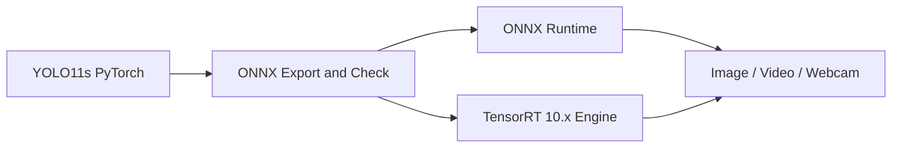

# YOLO11s Real-Time Detection & TensorRT Deployment

Production-oriented computer vision deployment pipeline for YOLO11s, covering PyTorch inference,
ONNX export, ONNX Runtime inference, TensorRT FP16 engine generation, real-time detection, and
latency benchmarking.

## Highlights

- Backend-independent detection dictionaries
- Image, video, and webcam inference
- OpenCV labels, confidence scores, and smoothed FPS
- ONNX graph checking and interface inspection
- Strict or automatic ONNX Runtime CUDA provider selection
- TensorRT 10.x static and dynamic engine generation
- Pinned host buffers, CUDA device buffers, asynchronous execution, and stream synchronization
- Class-aware NMS and source-coordinate box projection
- Synchronized PyTorch, ONNX Runtime, and TensorRT benchmarks
- Typed `src` layout, Python 3.10-3.13 CI, and hardware integration test entry point

## Deployment Pipeline



## Detection Contract

All inference backends return plain Python dictionaries:

```python
[
    {
        "class_id": 0,
        "class_name": "person",
        "confidence": 0.91,
        "bbox": [124.2, 68.5, 438.7, 612.1],
    }
]
```

## Project Structure

```text
yolo11-tensorrt-realtime/
|-- configs/                         # Dataset configurations
|-- src/yolo11_deploy/
|   |-- detector.py                  # Ultralytics adapter
|   |-- engine_builder.py            # TensorRT engine construction
|   |-- onnx_runtime.py              # ONNX Runtime backend
|   |-- onnx_validation.py           # ONNX graph validation
|   |-- preprocessing.py             # Letterbox and NCHW preprocessing
|   |-- postprocessing.py            # Decoding, NMS, and box projection
|   |-- protocols.py                 # Backend structural interfaces
|   |-- tensorrt_runtime.py          # TensorRT runtime and CUDA buffers
|   `-- video.py                     # Shared video and camera loop
|-- scripts/                         # Detection, export, build, and benchmark CLIs
|-- tests/                           # Unit and hardware integration tests
|-- docs/                            # Architecture and operating guides
|-- constraints.txt                  # Pinned development dependency set
|-- requirements.txt                 # CPU-oriented environment
`-- requirements-tensorrt.txt        # NVIDIA runtime environment
```

## Requirements

- Python 3.10 through 3.13
- PyTorch, Ultralytics, OpenCV, NumPy, and ONNX
- One ONNX Runtime distribution for ONNX inference
- NVIDIA CUDA and TensorRT 10.x for the TensorRT backend

## Installation

### Development Environment

Windows PowerShell:

```powershell
py -3.10 -m venv .venv
.\.venv\Scripts\Activate.ps1
python -m pip install --upgrade pip
python -m pip install -e ".[dev]"
```

Linux:

```bash
python3 -m venv .venv
source .venv/bin/activate
python -m pip install --upgrade pip
python -m pip install -e ".[dev]"
```

`constraints.txt` records the exact dependency baseline for the environment that produced the
current validation evidence. Apply it when checking that same Python and platform combination.

For an application environment, select exactly one ONNX Runtime extra:

```powershell
# CPU
python -m pip install -e ".[onnx-cpu]"

# NVIDIA CUDA Execution Provider
python -m pip install -e ".[onnx-gpu]"
```

### TensorRT Environment

Install a compatible NVIDIA driver, CUDA environment, and TensorRT 10.x release, then run:

```powershell
python -m pip install -r requirements-tensorrt.txt
```

See [Deployment Guide](docs/deployment.md) for environment checks and compatibility guidance.

## Quick Start

Ultralytics downloads the official `yolo11s.pt` weight on first use when it is not available
locally. Model artifacts are excluded from Git.

```powershell
python scripts/smoke_test.py
```

## Image, Video, and Camera

```powershell
python scripts/detect_image.py --model yolo11s.pt --source assets/demo.jpg --device cuda:0 --output outputs/detection.jpg
python scripts/detect_video.py --model yolo11s.pt --source video.mp4 --device cuda:0 --save outputs/detected-video.mp4
python scripts/detect_camera.py --model yolo11s.pt --camera 0 --device cuda:0
```

Video output supports MP4, AVI, and MOV with an extension-matched codec. Press `Esc` or `Q` to
close the preview. Use `--no-display` for headless video processing. Capture and writer resources
are released on normal exit and exceptions; saving zero frames is reported as an error.

## Export ONNX

```powershell
python scripts/export_onnx.py --model yolo11s.pt --imgsz 640 --output weights/yolo11s.onnx
python scripts/export_onnx.py --model yolo11s.pt --imgsz 640 --dynamic --output weights/yolo11s-dynamic.onnx
```

The exporter runs `onnx.checker.check_model`, reports graph inputs and outputs, and records opset and
class metadata before accepting the artifact.

## ONNX Runtime Inference

```powershell
python scripts/infer_onnx.py --model weights/yolo11s.onnx --source assets/demo.jpg --device auto --imgsz 640
```

`--device auto` prefers CUDA Execution Provider and permits CPU fallback. `--device cuda` is strict:
startup fails if CUDA is unavailable or cannot become the active provider. `--device-id` selects the
GPU, and `--imgsz` supplies dimensions for a dynamic ONNX model.

## Build a TensorRT Engine

Static FP16 engine:

```powershell
python scripts/build_tensorrt.py --onnx weights/yolo11s.onnx --engine weights/yolo11s-fp16.engine --fp16 --workspace 4
```

Dynamic optimization profile:

```powershell
python scripts/build_tensorrt.py `
  --onnx weights/yolo11s-dynamic.onnx `
  --engine weights/yolo11s-dynamic-fp16.engine `
  --fp16 `
  --min-imgsz 320 `
  --opt-imgsz 640 `
  --max-imgsz 1280
```

The builder validates TensorRT and CUDA availability, reports ONNX parser errors, configures the
workspace and optimization profile, and preserves class-name metadata in a JSON sidecar.

## TensorRT Inference

```powershell
python scripts/infer_tensorrt.py `
  --engine weights/yolo11s-dynamic-fp16.engine `
  --source assets/demo.jpg `
  --imgsz 640 `
  --output outputs/tensorrt-detection.jpg
```

For a dynamic engine, `--imgsz` must fall within its build profile. The runtime resolves shapes and
reallocates all I/O buffers. Deserialize only engine files built or supplied by a trusted source.

## Benchmarking

The benchmark utilities report mean latency, median/P50, P95, and FPS. GPU timings synchronize the
corresponding CUDA device or stream. See [Benchmark Methodology](docs/benchmark.md) for timing
boundaries.

```powershell
python scripts/benchmark_pytorch.py --model yolo11s.pt --device cuda:0 --imgsz 640 --half --warmup 50 --runs 200
python scripts/benchmark_onnx.py --model weights/yolo11s.onnx --device auto --imgsz 640 --warmup 50 --runs 200
python scripts/benchmark_tensorrt.py --engine weights/yolo11s-fp16.engine --imgsz 640 --warmup 50 --runs 200
```

## Validation

```powershell
python -m compileall src scripts tests
python -m ruff check src scripts tests
python -m pyright
python -m pytest -q
python scripts/smoke_test.py --offline
```

CI runs the CPU-safe gate on Python 3.10, 3.11, 3.12, and 3.13. On an NVIDIA TensorRT 10.x runner,
enable engine build and inference validation with:

```powershell
$env:YOLO_TRT_INTEGRATION = "1"
$env:YOLO_TRT_ONNX = "weights/yolo11s.onnx"
python -m pytest -q -m tensorrt
```

## Supported Model Output

The ONNX Runtime and TensorRT adapters decode standard Ultralytics YOLO detection exports with an
`[x, y, width, height, class scores...]` channel layout. Segmentation, pose, classification, and
end-to-end NMS plugin outputs require task-specific adapters.

## License

[MIT](LICENSE)
