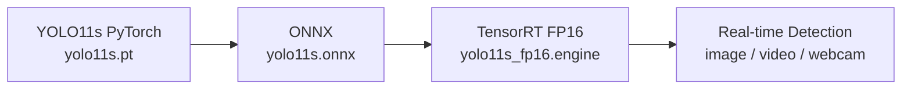

# YOLO11s Real-Time Detection & TensorRT Deployment

## Overview

An engineering-focused computer-vision portfolio project covering the complete deployment path
from an Ultralytics YOLO11s PyTorch model to ONNX Runtime and TensorRT FP16 real-time inference.
The repository emphasizes clean backend boundaries, repeatable latency measurement, and safe
optional GPU dependencies. It does not modify the YOLO backbone and does not train a model.

## Features

- Unified YOLO11s image inference contract with plain Python detection dictionaries
- Image, video, and webcam detection with boxes, labels, confidence, and FPS
- Current Ultralytics ONNX export path with artifact validation
- Shape-aware ONNX Runtime preprocessing, output decoding, NMS, and box rescaling
- TensorRT 10.x ONNX parser, FP16 engine builder, CUDA buffers, stream, and inference runner
- Synchronized PyTorch, ONNX Runtime, and TensorRT benchmarks
- CPU-safe tests and smoke checks; optional backends report `SKIP` rather than false success
- Windows PowerShell and Linux-compatible paths and commands

## Deployment Pipeline



## Historical Tasks

### RPS Recognition

Rock, paper, and scissors detection was part of the original project. Dataset files and training
are not reproduced here.

### Road Pothole Detection

The historical pothole task demonstrated dataset integration, YOLO inference, ONNX export, and
TensorRT deployment. **Metric not reproduced in this repository.** Dataset files are not included.

## Historical Experimental Results

| Task | Precision | Recall | mAP50 | mAP50-95 |
|---|---:|---:|---:|---:|
| RPS Recognition | 0.865 | 0.889 | 0.922 | 0.681 |

These are **historical results; training is not reproduced in this repository**. They must not be
interpreted as measurements produced by the current code checkout.

### Historical / Target Performance

The original project achieved millisecond-level inference with input `640 x 640`, batch size 1,
and TensorRT FP16 on an RTX 4070 Laptop GPU. Historical references were approximately 6.8 ms/image
for PyTorch FP32 and 3.9 ms/image for TensorRT FP16. These are **reference values, not reproduced in
this build**. Re-run the benchmark under the current hardware and software environment.

## Installation

### Basic

Python 3.10 or newer is required. Use an isolated environment.

Windows PowerShell:

```powershell
py -3.10 -m venv .venv
.\.venv\Scripts\Activate.ps1
python -m pip install --upgrade pip
python -m pip install -e ".[dev]"
```

Linux:

```bash
python3 -m venv .venv
source .venv/bin/activate
python -m pip install --upgrade pip
python -m pip install -e ".[dev]"
```

### TensorRT

TensorRT is optional. Install NVIDIA driver, CUDA, TensorRT 10.x, and a compatible `cuda-python`
package using NVIDIA's instructions for your operating system. Then install the project extras or
the optional requirement file:

```powershell
python -m pip install -r requirements-tensorrt.txt
```

Do not install an arbitrary CUDA or TensorRT version into an otherwise working system. See
[docs/deployment.md](docs/deployment.md) for compatibility and diagnostic checks.

## Quick Start

The first `yolo11s.pt` command may ask Ultralytics to download official pretrained weights. The
weight is excluded from Git. If the network is unavailable, provide a local model using `--model`.

```powershell
python scripts/smoke_test.py
```

## Image Inference

No `demo.jpg` is bundled. Without `--source`, the image script prints a friendly instruction.

```powershell
python scripts/detect_image.py --model yolo11s.pt --source assets/demo.jpg --device cuda:0
```

The output defaults to `outputs/detection.jpg`.

## Video Inference

```powershell
python scripts/detect_video.py --model yolo11s.pt --source video.mp4 --device cuda:0 --save
```

Supported extensions are MP4, AVI, and MOV. Press `Esc` or `Q` to quit. Add `--no-display` for a
headless run. `VideoCapture`, writer, and OpenCV windows are released in all normal exit paths.

## Webcam Detection

```powershell
python scripts/detect_camera.py --model yolo11s.pt --camera 0 --device cuda:0
```

Press `Esc` or `Q` to exit. An unavailable camera exits with a clear message and does not loop.

## Export ONNX

CPU FP32 export:

```powershell
python scripts/export_onnx.py --model yolo11s.pt --imgsz 640 --output weights/yolo11s.onnx
```

GPU FP16 export, if supported by the active Ultralytics version and CUDA environment:

```powershell
python scripts/export_onnx.py --model yolo11s.pt --imgsz 640 --half --device cuda:0 --output weights/yolo11s_fp16.onnx
```

The script verifies that the final ONNX file exists and is non-empty.

## ONNX Runtime Inference

```powershell
python scripts/infer_onnx.py --model weights/yolo11s.onnx --source assets/demo.jpg --device auto
```

`auto` chooses CUDA Execution Provider when installed and otherwise uses CPU Execution Provider.

## Build TensorRT

```powershell
python scripts/build_tensorrt.py --onnx weights/yolo11s.onnx --engine weights/yolo11s_fp16.engine --fp16 --workspace 4
```

The builder prints the installed TensorRT version, output path, and engine size. Engine files are
hardware and TensorRT-version specific and are excluded from Git.

## TensorRT Inference

```powershell
python scripts/infer_tensorrt.py --engine weights/yolo11s_fp16.engine --source assets/demo.jpg
```

The runner targets TensorRT 10.x named tensors and `execute_async_v3`, allocates host/device
buffers, uses a CUDA stream, synchronizes completion, applies NMS, and maps boxes to the source.

## Benchmark

Formal conditions are input 640 x 640, batch 1, 50 warmups, and 200 measured runs.

```powershell
python scripts/benchmark_pytorch.py --model yolo11s.pt --device cuda:0 --imgsz 640 --warmup 50 --runs 200
python scripts/benchmark_pytorch.py --model yolo11s.pt --device cuda:0 --imgsz 640 --half --warmup 50 --runs 200
python scripts/benchmark_onnx.py --model weights/yolo11s.onnx --device auto --warmup 50 --runs 200
python scripts/benchmark_tensorrt.py --engine weights/yolo11s_fp16.engine --warmup 50 --runs 200
```

GPU measurements synchronize before and after each timed call. Results are printed only for a
backend that actually ran; unavailable backends are `N/A` / `SKIP`, never invented numbers. See
[docs/benchmark.md](docs/benchmark.md).

## Project Structure

```text
configs/                 RPS and pothole dataset placeholders
src/yolo11_deploy/       backend-independent core package
scripts/                 inference, export, engine build, benchmark, and smoke CLIs
tests/                   CPU-safe unit tests
assets/                  instructions for user-provided media
docs/                    requirements, features, deployment, and benchmark notes
```

## Validation

```powershell
python -m compileall .
pytest -q
python scripts/smoke_test.py
python scripts/benchmark_pytorch.py --model yolo11s.pt --imgsz 640 --runs 20 --warmup 5
```

## Limitations

- No model training, datasets, weights, ONNX files, or TensorRT engines are committed.
- Raw YOLO11 detection exports are supported; segmentation, pose, classification, and end-to-end
  NMS plugin exports require backend-specific decoders.
- The TensorRT runner targets TensorRT 10.x. Rebuild engines after changing GPU, TensorRT, CUDA,
  model, input shape, or precision.
- Benchmark numbers are environment-specific and do not measure preprocessing or drawing unless a
  caller explicitly wraps those operations.

## Future Work

- Add dynamic-shape TensorRT optimization profiles.
- Add pinned host buffers and reusable preprocessing buffers.
- Add end-to-end video pipeline throughput and decode/encode profiling.
- Add CI matrices for supported Python, PyTorch, and ONNX Runtime versions.

## License

[MIT](LICENSE)

